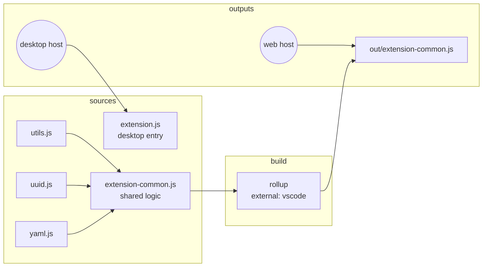

> **Audience:** Extension author · **Reading time:** 2 minutes

# Desktop and web architecture

The extension runs in two VS Code hosts: the desktop Extension Host (Node) and the web Extension Host (browser sandbox). One source tree serves both, through two entry points and a build step.

## The structure

## Why two entry points

The manifest declares both:

| Field | File | Host |
| --- | --- | --- |
| `main` | `./extension.js` | desktop, may use Node APIs |
| `browser` | `./out/extension-common.js` | web, Node built-ins are absent |

`extension.js` can require Node modules directly. `extension-common.js` cannot: rollup bundles it into one file with `external: ['vscode']`, so every `require` in the output must be `vscode` — the only module the web host provides. That constraint is what `npm run check:bundle` asserts, and the reason an accidental `fs` import in shared code is caught at build time instead of at a user's machine.

## Why shared logic exists at all

Almost every command's logic is host-independent: read arguments, compute a string, return it. Writing that logic once in `extension-common.js` and letting both entries use it means a fix lands in both hosts with one edit. The desktop entry adds the few commands that genuinely need Node (the persistent remember file, for example).

## What rollup contributes

- one output file, so the manifest's `browser` field names a single artifact,
- `external: ['vscode']`, so the host provides the API module,
- a size budget, enforced by the bundle check, so an accidental dependency import is caught before release.

The [module graph](../reference/module-graph.md) shows the file-level picture; [build and release](../reference/build-release.md) shows the commands.
