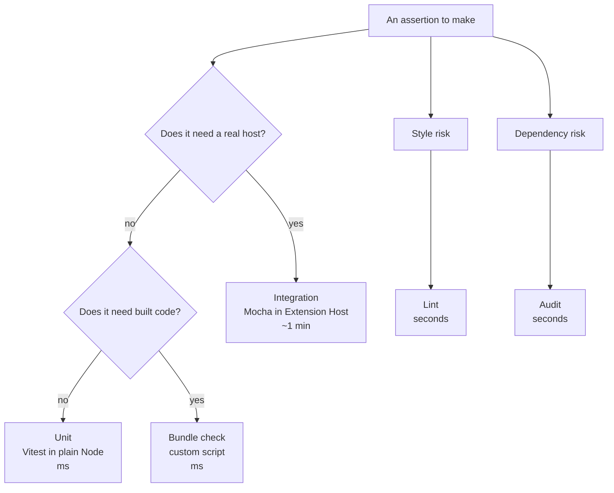

> **Audience:** Extension author · **Reading time:** 2 minutes

# Why multiple test runners

The repository runs its tests through three runners plus static and supply
chain checks. That looks like ceremony. It is not: each runner exists because a
single runner cannot both run in 200 ms without VS Code and prove that a real
Extension Host activates the extension.

## The one-sentence rule

**Choose the cheapest layer that can express the assertion.**

## What forces more than one runner

The two hard requirements pull in opposite directions:

| Requirement | What it needs |
| --- | --- |
| fast feedback on every save | no VS Code download, no Extension Host, no window |
| proof that activation registers 80 commands | a real Extension Host |

The stub cannot prove registration: it can only record what the extension
asked for. The real host cannot be afforded for every assertion: it costs a
download and about a minute. So the repository uses both, each where it is
cheapest, plus three checks that are neither: bundle safety, lint and audit.

## The cost of the answer

| Layer | Cost | What you get for it |
| --- | --- | --- |
| Unit | milliseconds | logic, manifest contract, guardrails |
| Bundle check | milliseconds | web bundle requires only `vscode`, size budget holds |
| Lint | seconds | no accidental globals |
| Audit | seconds | no known vulnerabilities in shipped dependencies |
| Integration | ~1 min + download | activation works; the command surface exists; end-to-end runs |

## The decision in practice

Adding a test? Ask which layer can express it. A new argument-parsing branch is
unit. A new command's existence after activation is integration. A forbidden
import is the bundle check or lint. A vulnerability advisory is the audit.
When two layers can express it, the cheaper one wins, and the other layer does
not get a duplicate.

The factual matrix (tools, configs, costs) is on
[testing](../reference/testing.md); what each layer is trusted to prove is on
[test strategy](test-strategy.md).