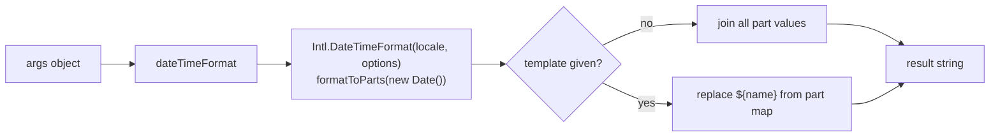

> **Audience:** Extension author · **Reading time:** 2 minutes

# Reference: the dateTime family

This page maps the `dateTime` family to the source, the manifest and the tests. The Extension user view of the same commands is the [date and time commands](../../extension-user/reference/date-time.md) page.

## Where each part lives

| Part | Location |
| --- | --- |
| Command registration | `extension-common.js`, in `activate` |
| Formatting logic | the local `dateTimeFormat` function in `extension-common.js` |
| Activation events | `package.json`, `onCommand:extension.commandvariable.dateTime` and `...dateTimeInEditor` |
| Palette entry | `package.json`, `contributes.commands` (only `dateTimeInEditor` has a title) |
| Unit test | `test/unit/extension-common.test.js`, "formats the date using a template" |

## How the implementation is shaped

One implementation serves both commands:

- `extension.commandvariable.dateTime` is registered with `vscode.commands.registerCommand` and returns the string as the command result.
- `extension.commandvariable.dateTimeInEditor` is registered with `vscode.commands.registerTextEditorCommand` and replaces the current selection with the same computed string.

The arguments are read with `getProperty` and defaulted with `dblQuest`, so a missing `args` behaves as an empty object rather than throwing. The `template` replacement uses a `\${(\w+)}` regular expression against the part map built from `formatToParts()`, so an unknown placeholder becomes an empty string.

## What the tests prove, layer by layer

| Layer | Test | What it proves |
| --- | --- | --- |
| Unit | `registered` contains `extension.commandvariable.dateTime` | the command is registered on the shared surface |
| Unit | `__invoke` with a fixed `locale` and `timeZone: 'UTC'` | template substitution produces the expected shape |
| Integration | command runs in a real Extension Host | registration happens at activation, end to end |

The unit test pins `timeZone: 'UTC'` so the assertion cannot fail on a machine in a different time zone. Follow that pattern for any new time-sensitive assertion.

## Why this family is the worked example

The family exercises every part of the contract with the smallest code: two activation events, one palette entry, one implementation, one unit test and one integration path. The [add a command end to end](../tutorials/add-a-command-end-to-end.md) tutorial uses it as the template for new commands.
