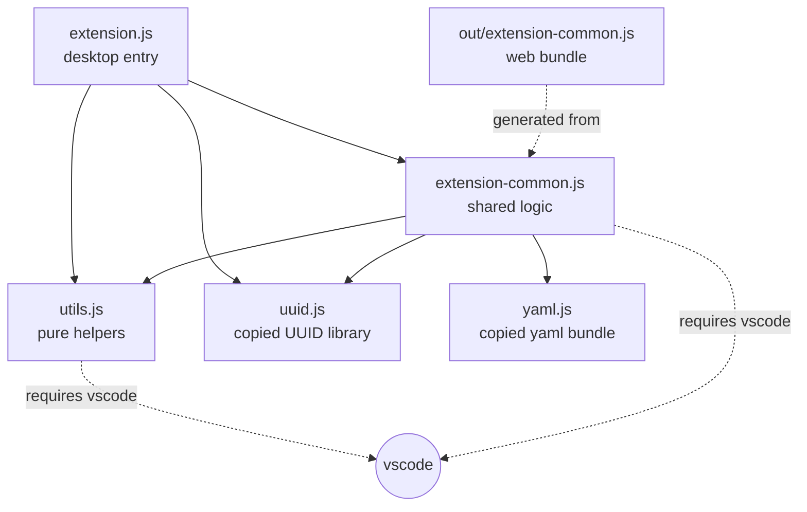

> **Audience:** Extension author · **Reading time:** 1 minutes

# Module graph

Which file requires which, at module scope. The graph explains why some code can be shared between the desktop and web entry points and some cannot.

## Reading the graph

- `extension.js` is the desktop entry point. It may use Node APIs.
- `extension-common.js` is the shared logic. It must not use Node built-ins: rollup bundles it into `out/extension-common.js`, and the web Extension Host provides only `vscode`. See [desktop and web architecture](../explanation/desktop-web-architecture.md).
- `utils.js` holds pure helpers. It calls `require('vscode')` at module scope like the rest, and the test double replaces that import in unit tests.
- `uuid.js` and `yaml.js` are copied libraries, tracked in the manifest's `vendored` field. See [dependency and vendoring policy](../explanation/dependency-vendoring-policy.md).
- `uuid-org.js` is the upstream copy of the UUID library. The build does not consume it; it is excluded from lint and from the package. It is a deletion candidate, deliberately deferred.

## The rule the bundle check enforces

`out/extension-common.js` must require nothing but `vscode`. A Node built-in there breaks the web extension host; `npm run check:bundle` fails with the module name when one appears.
