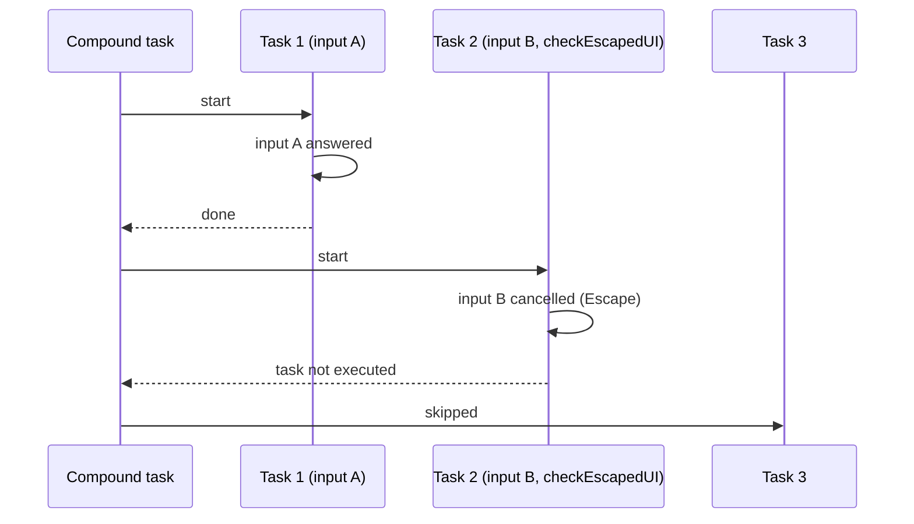

> **Audience:** Extension user · **Reading time:** 1 minutes

# Cancelled inputs and compound tasks

When you press `Escape` on a prompt that a task shows, the task does not run. That is correct for one task. In a compound task — one that runs several tasks in sequence — a cancelled prompt in the middle would otherwise leave the remaining tasks to run with missing or stale values. The `checkEscapedUI` property exists to stop them.

## What "escaped" means here

The input prompts of this extension (`pickFile`, selection lists, text prompts) record whether they were cancelled. A command or variable with `checkEscapedUI: true` checks that record first. If the previous prompt in the run was cancelled, the command behaves as if it were cancelled itself, and the task does not start.

## The sequence

## The one rule that surprises people

Do **not** put `checkEscapedUI` on the first prompt of a run. The check looks at the previous run's state, so on the first prompt it would report the cancel recorded the last time you ran the sequence — cancelling this run before any prompt has appeared.

## Which commands accept it

`pickStringRemember`, `promptStringRemember`, `pickFile`, `openDialog`, `saveDialog` and `remember` accept the property, as command argument or as part of the variable's key (see [the remember variable](../reference/variable-remember.md)).

## Why this is the design

Cancellation is not an error: you changed your mind. The extension treats it as an instruction — "stop this run" — and records it so the rest of the run can honour it. A task that starts with missing values would either fail confusingly or, worse, run with defaults. Stopping is the honest behaviour. The [how-to page](../how-to/compound-task-cancelled-input.md) shows the configuration.
