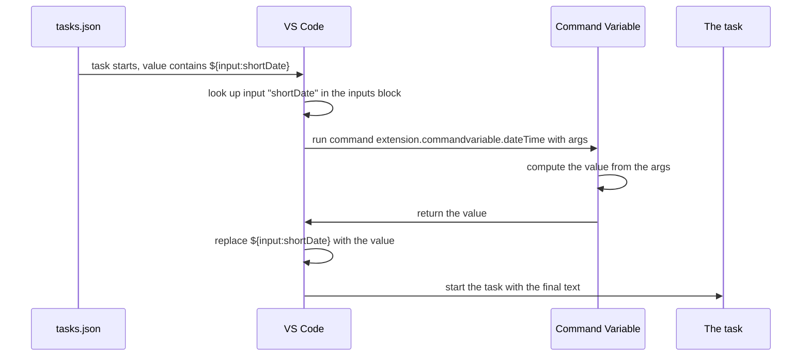

> **Audience:** Extension user · **Reading time:** 2 minutes

# How a command variable resolves

When you write `${command:extension.commandvariable.dateTime}` in a `launch.json` or `tasks.json`, something happens before your task or launch configuration runs. This page follows the value from the file to the finished result, so the rest of the documentation stops being magic.

## The short version

VS Code collects every `${...}` placeholder in your configuration, replaces each with a computed value, and only then starts the task or launch. A command variable is one kind of placeholder: its value is the result of running a VS Code command.

## Step by step



1. **You start the task or launch configuration.** Substitution happens at this moment, not when you save the file.
2. **VS Code finds the placeholder.** It reads `${input:shortDate}` and looks up the input with id `shortDate` in the `inputs` block of the same file.
3. **The input names a command.** An input of type `command` carries a `command` field and an optional `args` field. VS Code runs that command with those arguments.
4. **The extension computes the value.** For the date and time commands this is a formatting of the current moment, as described on the [date and time commands](../reference/date-time.md) page.
5. **The result replaces the placeholder.** The task then runs with the final text. If the command returns nothing useful, the literal text may survive into the task; see [the variable did not resolve](../how-to/variable-did-not-resolve.md).

## Why `inputs` exists

`${command:...}` can appear directly in a value, but an `inputs` entry gives you a named place for the arguments. One input can be used by several tasks in the same file, and the `id` keeps the configuration readable:

```json
"args": [ "${input:shortDate}" ]
```

means "substitute the value of the input named `shortDate` here".

## Keybindings are different

A keybinding cannot carry an `inputs` block, so the editor variant of each command (`dateTimeInEditor`, `UUIDInEditor`, `file.contentInEditor`) writes its result into the text you are editing instead of returning a value. That is why the same formatting exists as two commands on the [date and time](../reference/date-time.md) page.

## What this explains

- A `${...}` placeholder in a log means substitution did not happen; the file was read as text.
- A value that changes between runs is correct: substitution happens when the task starts, so a date and time variable is evaluated then.
- An `inputs` entry is only consulted when something references its `id`.
