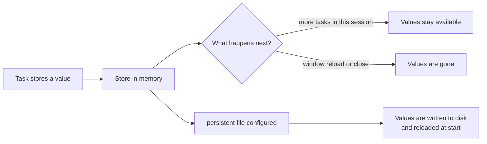

> **Audience:** Extension user · **Reading time:** 2 minutes

# The remember store

Several commands can store a value under a key and let a later task read it
back. The place where those values live is the remember store. This page
explains how it behaves; the commands that use it are on the
[remember commands](../reference/remember.md) reference page.

## What writes to it

| Command | What it stores | Under which key |
| --- | --- | --- |
| `pickStringRemember` | the picked value | its `key` argument (default `pickString`) |
| `promptStringRemember` | the entered text | its `key` argument (default `promptString`) |
| `file.pickFile` | the picked file path | its `keyRemember` argument (default `pickFile`) |
| `file.content` | the extracted value | its `keyRemember` argument (default `fileContent`) |
| `remember` | whatever you give its `store` argument | the keys of that object |

## What reads it

- The `remember` command, with a `key` argument.
- The `${remember:...}` variable, usable inside the `args` of other commands
  of this extension (see [the remember variable](../reference/variable-remember.md)).

## How long values live

By default the store lives in memory for the session. That breaks the natural
assumption that each task run is independent — it is a deliberate trade: the
extension can answer "the value you gave earlier" without a file format or
cleanup rules. When the window reloads, the store is empty again.

With the `commandvariable.remember.persistent.file` setting, the store is
written to a JSON file on the local disk and read back when the extension
starts, so values survive reloads. Remote workspaces are not supported for
this: the file must be on the local file system. The setting is described on
the [settings page](../reference/settings.md).

## Values you can rely on

- A key holds one value; storing again overwrites it.
- The store starts with one key, `empty`, whose value is the empty string. It
  is useful when a command must store values but return nothing.
- Reading a key that was never stored returns `I don't remember`, or the
  `default` you passed.

## Why this helps

A pick-once workflow — choose the environment at the start of the session, use
it in every task afterwards — needs exactly this: one question, many reads,
no repetition. The [select and remember a value](../tutorials/select-and-remember-a-value.md)
tutorial builds that workflow.
